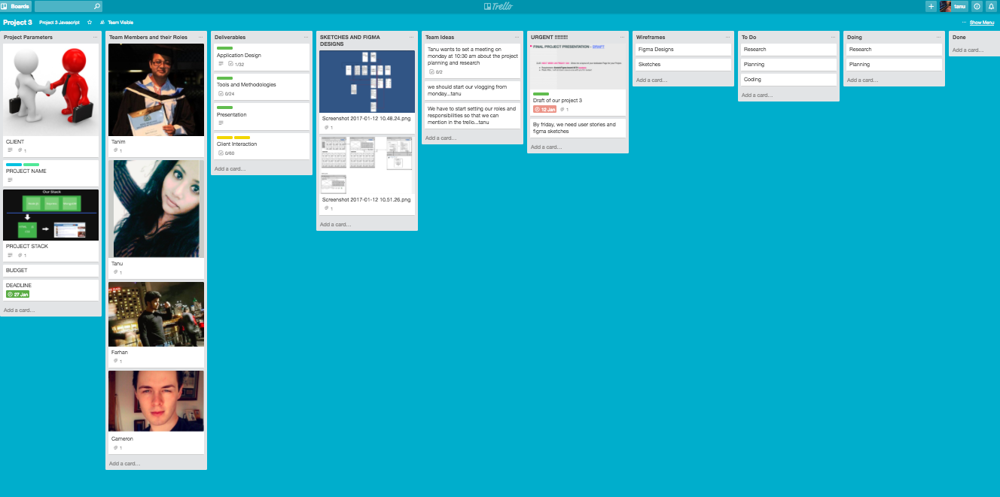
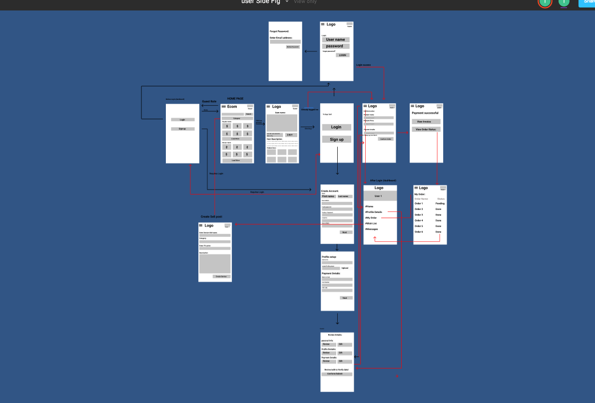
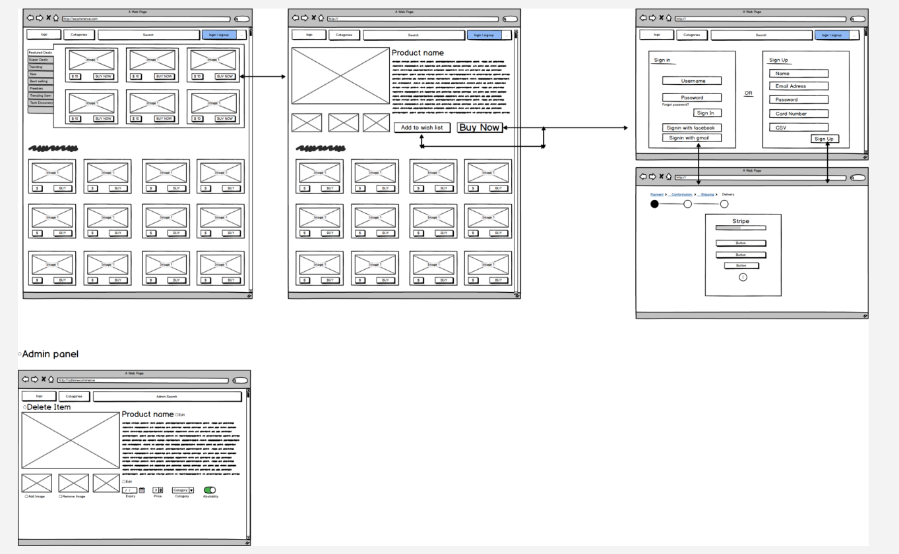

# Coder Factory Term 3 Project (Javascript)

### lapshop 

A site that helps you find the good quality second hand Apple Laptops at the best prices in the market.

# Live - Coming Soon….

## Client Name
Mathew
MacShop, Elizabeth Street, Melbourne Central

Client interaction

Demonstrate your ability to satisfy your client with the quality of your work and high level of service.

1. Record all interactions with your client in a diary format.

##### First Meeting

##### Second Meeting

##### Third Meeting

##### Fourth Meeting

##### Fifth Meeting

### Problem

Buying second-hand Apple laptops online is always green, but it’s easy to be discouraged by the stories of broken laptops from eBay or Craigslist. Also, Not everyone can afford the high price of apple laptops specially students.Furthermore, there are very few online retailers that sell good quality laptops that give you assurance to return the products with easy money back guarantee.

### Solution

Our application will be the best choice for the people struggling to buy good quality second hand Apple laptops at affordably less price than the market. This app will give them access to choose from various ranges of the bestselling apple laptops. Customers will find multiple payment methods to choose that includes visa, MasterCard, American Express and many more.

### Setup on Local Machine!

COMING SOON…….

### Workflow diagram of the user journey/s

### User Stories

* As a customer, I want to Signup with my email address, username and password, so that I can create my account and do future Login’s.
* As a customer, I want to login with my email address and password so that I can able to buy and search the products.
* As a customer, I want to logout, so that no one can gain access to my account.
* As a customer, I want to create a profile, so that I can see my personal details and view my item purchase history and the amount I spent on  them.
* As a customer, I want to edit my profile, so that I can edit my account and personal details, for .eg Address, whenever I want.
* As a customer, I want to delete my account so that I can remove my access to the app whenever I want.
* As a customer, I want to see my cart so that I know how many products I am buying.
* As a customer, I want to search products so that I can choose what products I want.
* As a customer, I want to pay for the products I am buying so that I can able to purchase them.

#### As a Admin, 

* As a Admin, I want to login with my email address and password so that I can see every history and details related to the application.
* As a Admin, I want to logout, so that no one can gain access to my account and the admin panel.
* As a Admin, I want to add a product to my application so that I can I can add products for the customers.
* As a Admin, I want to update a product so that I can I can keep my products details and pictures up-to-date for the customers.
* As a Admin, I want to delete the products so that I can remove the products if they are no longer available.
* As a Admin, I want to see my customer address details so that we can send the product to the right destination.
* As a Admin, I want to upload a picture of my product so that customer have an eye-view of the product they are going to buy.

#### Project plan and estimation

Used Trello for plan and estimation

### Designs and Sketches

Trello Board Link https://trello.com/b/pGAZg3FG/project-3

#### Figma Design

#### Balsamic Sketch

#### Logo Design

#### Tools Used

* Trello - as a project management tool to track progress, plan and estimate.
* Figma - to draw and host workflow diagram of the user journey/s.
* Balsamiq Mockups - for wireframing.
* vysor- for wire framing
* Cloudinary - For managing image and file in the cloud.
* Heroku - to host the app.
* Atom - as a test editor.
* Git - For version control.
* Github - as an online repository

#### Frameworks and Packages used

* async  
* bcrypt-nodejs
* body-parser 
* connect-mongo 
* cookie-parser
* ejs-mate
* express
* express-flash
* express-session
* faker
* mongoose
* morgan
* passport
* passport-local
* stripe

#### Deployment

#### API’S

### ASSIGNMENT CRITERIA
✔️ = Done 😊 | ❌ = Not Done 😞 | ❎ = Kinda Done 😑
#### Setting expectations with your clients

1. When approaching your client, be upfront about this being a project you are doing as part of your Diploma.
2. There is to be no expectations on you, the students, to deploy the application for use of the client. Make sure the client is aware of this and is agreed upon.
3. There is to be no confidentiality agreement to be entered into.
Deliverables

Client interaction

Demonstrate your ability to satisfy your client with the quality of your work and high level of service.

1. Record all interactions with your client in a diary format.
2. Plan information gathering activities to determine project requirements, constraints and risks
3. Develop project charter, including preliminary statement of project scope and obtain sign-off
4. Prepare project work breakdown, schedule and budget
5. Compile project management plan documents as necessary to communicate the intended management strategy for the project and obtain sign-off
6. Identify and select team members, and allocate roles and responsibilities, based on project solution requirements
7. Determine training and support needs of team members
8. Establish project team values and agreed behavioural standards with team members
9. Monitor delivery and acceptance of assigned project team work activities and manage individuals
10. Monitor and control project scope changes, risks and issues
11. Manage system testing and hand over activities
12. Prepare IT support plans and maintenance or support documents
13. Obtain final project sign-off
14. Conduct post project review
15. Create a questionnaire for the client to ascertain the satisfaction with your product and service.
Application Design

Demonstrate your ability to break down the problem and design a solution.

1. One page summary of your application including problem definition, solution.
2. Determine the appropriate client technology, development tools, and platform for writing the UI
3. Review the conceptual design with the client, and edit as required
4. A workflow diagram of the user journey/s.
5. Wireframes for at least 5 screens.
6. User stories for the whole application.
7. Entity Relationship Diagram (ERD).
8. Project plan and effort estimation.
Tools and methodologies

1. Trello or similar project management tool to be used to track progress of build.
2. Show evidence of Slack conversations or use of other communication tools.
3. Git
4. Github. Demonstrate use of frequent commits, pull requests, documentation.
5. Use Agile development methodologies.
6. Provide evidence you have used code quality tools

